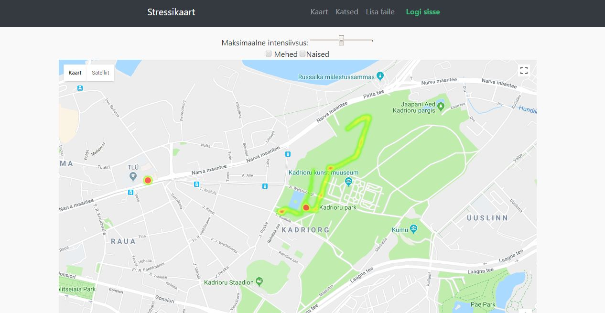

# Stressikaart

# Eesmärk ja lühikirjeldus
Eesmärk oli luua kliendile ajulainete ja GPSi andmete põhjal kaardirakendus, mis kuvab suhtelist stressitaset kohtades, kus on läbi viidud eksperiment. Eksperimendiks kasutatakse nutitelefoni (GPS andmete kogumiseks) ja Muse peavõru (ajulainete andmete kogumiseks). Selleks, et stressitaset kaardil kuvada, tuleb sisestada CSV failidena Muse andmed, GPX failidena Endomondo andmed ja need omavahel ühendada.

Projekt on loodud Tallinna Ülikooli Digitehnoloogiate instituudis tarkvaraarenduse praktika kursuse raames.
# Kasutatud tehnoloogiad
- Backend - PHP, simpleXML laiendus, SQL andmebaas
- Frontend - Javascript, AJAX, Google maps API, jQuery
- Disain - CSS, Bootstrap
# Projekti liikmed
Marek Kivikink, Peeter Roop, Oskar Juksar, Tuule Põldsaar
# Paigaldusjuhend
  - Installeerida oma veebiserverisse PHP versioon: 5.6.31 või kõrgem
  - Installeerida PHP'le simpleXML ja mySQLI laiendid
  - Installeerida veebiserverisse MariaDB versiooniga 10.2.8 või uuem (Sobib ka samaväärne mySQL).
  - Laadida alla failid: https://github.com/mkivikin/solid-garbanzo.git
  - Laadida need üles oma serverisse lemmik FTP clientiga, näiteks WinSCP.
  - Lisada write õigus uploads kaustale
  - Luua andmebaasi tabelid andmebaas.sql faili abil, failist sql.txt luua protseduur m1 (defineeritud kommentaarina megatabel)
  - Konfigureeri config.php vastavalt oma andmebaasile. (Vajalikud muutujad serverHost, serverUsername, serverPassword oma        vastavate väärtustega)
  - Tehtud!
# Litsents 
https://github.com/mkivikin/solid-garbanzo/blob/master/LICENSE
